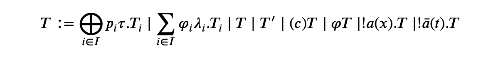
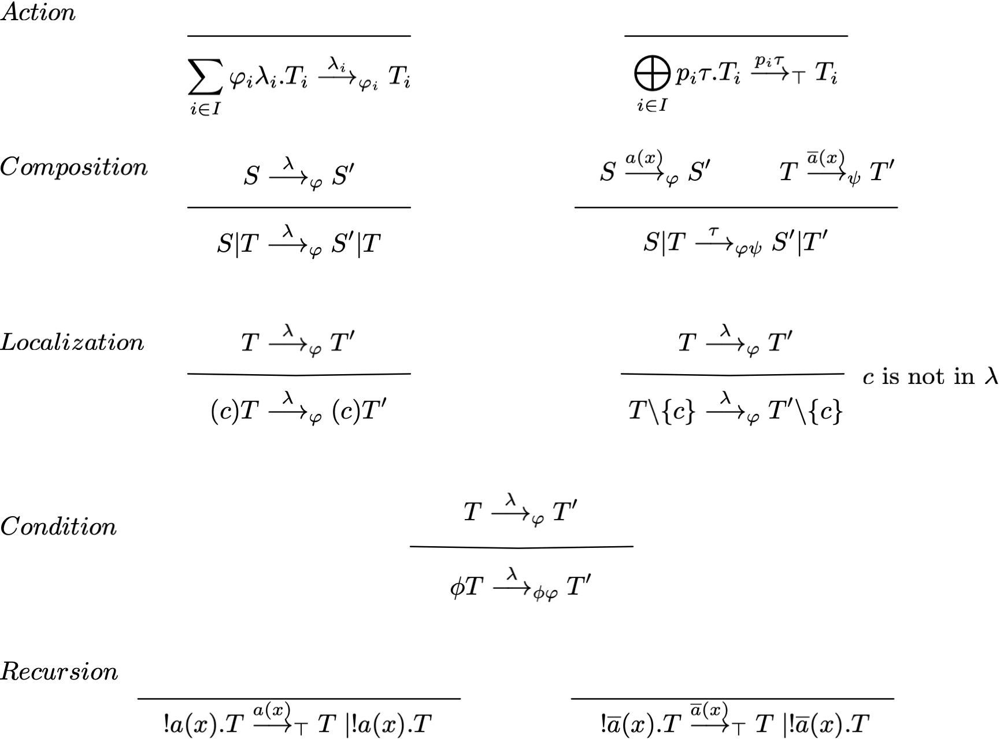
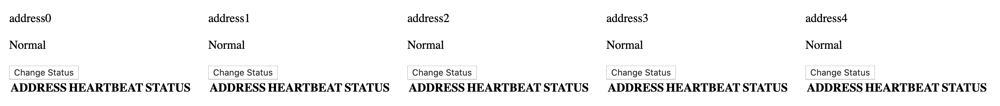
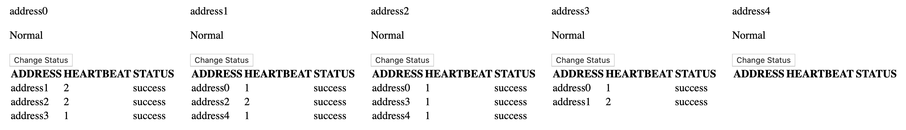
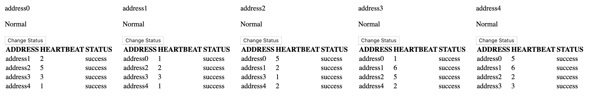
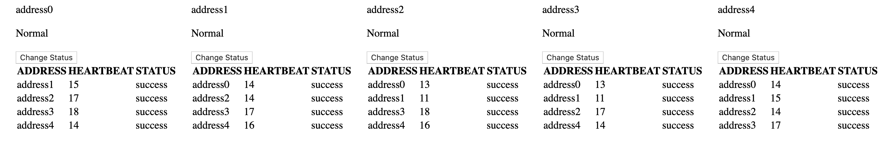
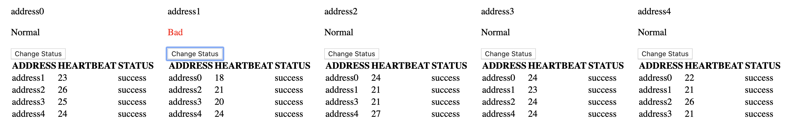
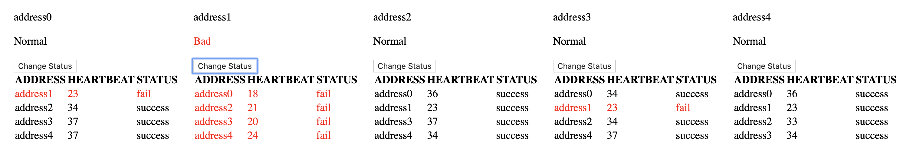
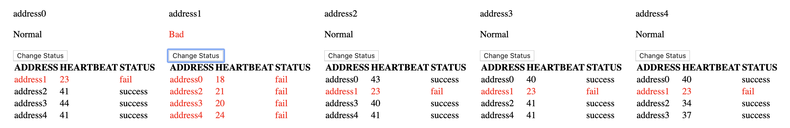

# A Gossip-Style Membership Protocol Implemented Using RVPC

毕业设计Demo，使用随机进程模型RVPC建模基于Gossip-Style Membership协议的一个通信过程。

### 随机进程模型RVPC

随机进程模型RVPC是基于[The Value-Passing Calculus](https://link.springer.com/chapter/10.1007/978-3-642-39698-4_11)的概率扩展，概率扩展方法使用了[A Uniform Approach to Random Process Model](https://arxiv.org/abs/1906.09541)的通用方法，在VPC的基础上增加了随机选择操作子，并定义了随机选择操作子的迁移语义。

RVPC的语法定义与迁移语义如下：





### 实现效果

我们基于随机进程模型RVPC实现了基于Gossip-Style Membership协议的一个通信过程。

动态效果：


Gossip消息的传播：







Failure Detection:









### 如何运行

```bash
git clone https://github.com/Angeladadd/AGossipStyleMembershipProtocolImplementedUsingRVPC.git
cd AGossipStyleMembershipProtocolImplementedUsingRVPC
go run main.go
```
打开浏览器输入```localhost:8080/index``` 


